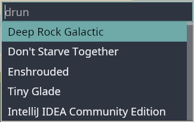

# `elbey`

[](https://crates.io/crates/elbey)
[](https://github.com/kgilmer/elbey/actions/workflows/ci.yml)


A [desktop app](https://www.freedesktop.org/wiki/Specifications/desktop-entry-spec/) launcher implemented in Rust on [the `iced` UI framework](https://github.com/iced-rs/iced) for Linux.  Upon launch, the program lists all of the locally installed desktop apps with a filter widget set above.  To launch, hit `enter` on the selected item, or use the mouse.

## Status

The application is functional in that desktop apps can be launched from the dialog.

## Configuration

All configuration is done via arguments:

```console
$ elbey --help
Usage: elbey [--height <height>] [--width <width>] [--theme <theme>] [--filter-font-size <filter-font-size>] [--entries-font-size <entries-font-size>] [--icon-size <icon-size>] [--hint <hint>] [--list-search-paths] [--reset-cache]

Desktop app launcher

Options:
  --height          height
  --width           width
  --theme           theme name:
                    CatppuccinFrappe,CatppuccinLatte,CatppuccinMacchiato,CatppuccinMocha,Dark,Dracula,Ferra,GruvboxDark,GruvboxLight,KanagawaDragon,KanagawaLotus,KanagawaWave,Light,Moonfly,Nightfly,Nord,Oxocarbon,TokyoNight,TokyoNightLight,TokyoNightStorm,AyuMirage
  --filter-font-size
                    font size for the filter input
  --entries-font-size
                    font size for the entry list
  --icon-size       icon size
  --hint            hint string to display in the entry box (max 16 chars)
  --list-search-paths
                    print the desktop application search paths and exit
  --reset-cache     clear the application cache before loading apps
  --help, help      display usage information
```

## Documentation

The `rustdoc` is available here: [https://kgilmer.github.io/elbey](https://kgilmer.github.io/elbey)

## Get it



Elbey can be installed via `cargo install elbey` or from source in this git repository:

### Build

```shell
cargo build --release
```

### Launch/Test

```shell
./target/release/elbey
```

### Install

```shell
cargo install --path .
which elbey # where cargo installed the binary
```

## Credit

This program was inspired by the friendly docs of [`iced`](https://github.com/iced-rs/iced) itself, other desktop app launchers such as [pop-launcher](https://github.com/pop-os/launcher) and [onagre](https://github.com/onagre-launcher/onagre), [`gauntlet`](https://github.com/project-gauntlet/gauntlet/), [`iced_launcher`](https://github.com/Decodetalkers/iced_launcher), and the greater Rust desktop cohort.  Of course the venerable [`rofi`](https://github.com/davatorium/rofi) must also be mentioned.

Project logo was created by Mira Gilmer.
