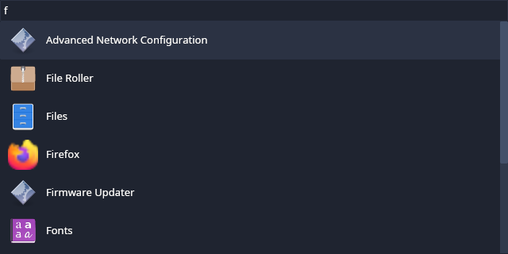

# `elbey`


A basic [desktop app](https://www.freedesktop.org/wiki/Specifications/desktop-entry-spec/) launcher implemented in Rust on [the `iced` UI framework](https://github.com/iced-rs/iced) for Linux.  This project is intentionally simple and "low abstraction" to aid in discovery and experimentation.  Upon launch, the program lists all of the locally installed desktop apps with a filter widget set above.  To launch, hit `enter` on the selected item, or use the mouse.

## Status

The application is functional in that desktop apps can be launched from the dialog.  There is no caching, modes, persistent memory, custom theming, or other fancy features.  But, you can add them yourself if you want!

## Feature Ideas

Things that might be fun to add to `ebley`:

* Sort the entries by usage or name
* Implement page up and page down
* Add caching to speed up retrieval of the apps
* Show app icons in addition to the titles
* Allow theme to be selected from the command line
* Allow for custom themes

## Tests

There are a [few unit tests](https://github.com/kgilmer/elbey/blob/main/src/app.rs#L234) that exercise some basic functions.

## Documentation

The `rustdoc` is available here: [https://kgilmer.github.io/elbey](https://kgilmer.github.io/elbey)

## Get it



Elbey is only distributed via source here.

### Build

```shell
cargo build --release
```

### Launch/Test

```shell
./target/release/elbey
```

### Install

```shell
cargo install --path .
which elbey # where cargo installed the binary
```

## Credit

This program was inspired by the friendly docs of [`iced`](https://github.com/iced-rs/iced) itself, other desktop app launchers such as [pop-launcher](https://github.com/pop-os/launcher) and [onagre](https://github.com/onagre-launcher/onagre), and the greater Rust desktop cohort.  Of course the venerable [`rofi`](https://github.com/davatorium/rofi) must also be mentioned.

Project logo was created by Mira Gilmer.
